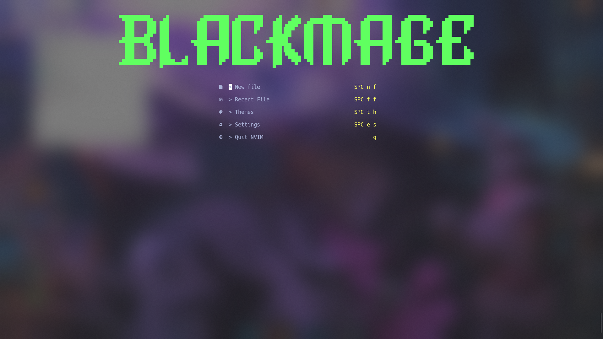
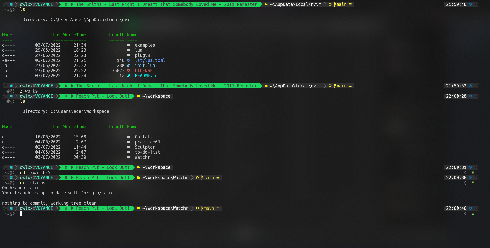
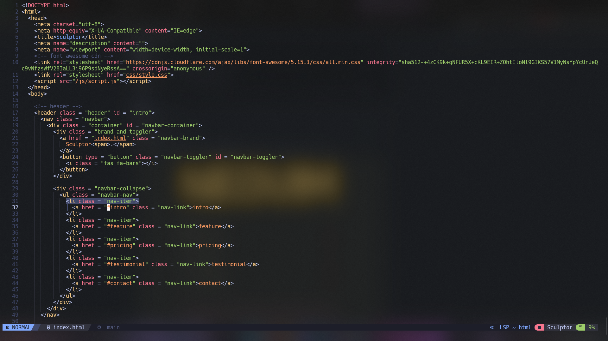

# My Dotfiles

## Contents

- vim (NeoVim) config
  - Plugins and base config from [nvchad](https://nvchad.github.io/)
- PowerShell config

## Vim setup

Requires Neovim (>= 0.5)

- [packer.nvim](https://github.com/wbthomason/packer.nvim) - A use-package inspired plugin manager for Neovim.
- [telescope.nvim](https://github.com/nvim-telescope/telescope.nvim) - Fuzzy finding select menu with text.
- [bufferline.nvim](https://github.com/akinsho/bufferline.nvim) - Top bar tab+buffer line for neovim (can be used for managing buffers and tabs, closing them).
- [nvchad's statusline](https://github.com/NvChad/NvChad/blob/main/lua/ui/statusline.lua) - Fast NeoVim statusline plugin written in lua.
- [nvim-tree.lua](https://github.com/kyazdani42/nvim-tree.lua) - A file explorer tree for NeoVim written in lua.
- [nvim-lsp-installer](https://github.com/williamboman/nvim-lsp-installer) - An LSP server installer
- [indent-blankline.nvim](https://github.com/lukas-reineke/indent-blankline.nvim) - Indentline plugin.
- [alpha.nvim](https://github.com/goolord/alpha-nvim) - Dashboard plugin for NeoVim.
- [base64](https://github.com/NvChad/base46) - Manages syntax colorscheme in NvChad.
- [nvim-colorizer.lua](https://github.com/norcalli/nvim-colorizer.lua) - Fastest NeoVim colorizer, colors hex colors, hsl codes, etc.
- [nvim-web-devicons](https://github.com/kyazdani42/nvim-web-devicons) - Lua fork of vim devicons which lets you change colors and edit icons of filetypes.
- [nvim-treesitter](https://github.com/nvim-treesitter/nvim-treesitter) - NeoVim Treesitter configurations and abstraction layer.

#### Language Server Plugins

- [nvim-lspconfig](https://github.com/neovim/nvim-lspconfig) - Used for configuring lsp servers etc.
- [nvim-cmp](https://github.com/hrsh7th/nvim-cmp) - Completion menu.

#### Misc Plugins

- [gitsigns.nvim](https://github.com/lewis6991/gitsigns.nvim)
- [nvim-autopairs](https://github.com/windwp/nvim-autopairs)
- [comment.nvim](https://github.com/numToStr/Comment.nvim)

## PowerShell setup

- [Scoop](https://scoop.sh/) - A command-line installer
- [Git for Windows](https://gitforwindows.org/)
- [Oh My Posh](https://ohmyposh.dev/) - Prompt theme engine
- [Terminal Icons](https://github.com/devblackops/Terminal-Icons) - Folder and file icons
- [PSReadLine](https://docs.microsoft.com/en-us/powershell/module/psreadline/) - Cmdlets for customizing the editing environment, used for autocompletion
- [z](https://www.powershellgallery.com/packages/z) - Directory jumper
- [PSFzf](https://github.com/kelleyma49/PSFzf) - Fuzzy finder

## About me

- [Instagram](https://www.instagram.com/fxzaaa/)
- Discord : faz#8303
